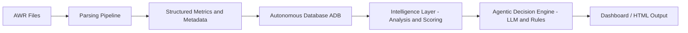

# OCI AWR Agentic AI Sizing Advisor

## Overview

The OCI AWR Agentic AI Sizing Advisor is an **agentic AI-driven platform** that transforms Oracle AWR reports into **structured intelligence and actionable performance and sizing decisions**.

It enables:
- Performance diagnostics  
- Multi-snapshot trend analysis  
- Decision-oriented insights  
- Infrastructure sizing guidance  

The architecture is **platform-agnostic** and can run across OCI, on-prem, and DB@X environments.

---

## Core Value Proposition

**From AWR → to insight → to decision**

- NOT a static report generator  
- NOT a chatbot  

This IS:

- An **autonomous performance and infrastructure sizing advisor**

---

## Architecture

### Data Flow

AWR (.out files)  
→ Parsing Pipeline  
→ Structured Metrics + Metadata  
→ Autonomous Database (ADB)  
→ Intelligence Layer  
→ Agentic Decision Engine  
→ Dashboard / HTML Output  

---

## Architecture Diagram

---

## OCI Services (Current Implementation)

- Object Storage – raw AWR files  
- Autonomous Database (ADB) – structured storage  
- Python processing layer – parsing and analytics  
- HTML dashboard – visualization  

---

## Current System Status

- Parsing: Complete  
- ADB Ingestion: Complete  
- Multi-AWR Support: Implemented  
- Metadata Normalization: Complete  
- Dashboard: Presentation-ready  
- Deterministic Analysis: Complete  

- Scoring Engine: In Progress  
- Recommendation Persistence: Planned  
- Action Tracking: Planned  
- Outcome Tracking: Planned  
- Agentic Decision Layer: Evolving  

---

## Key Capabilities

### Multi-AWR Time-Series Analysis
- Processes multiple AWR snapshots  
- Builds workload behavior over time  
- Enables trend analysis and anomaly detection  

---

### Cluster-Aware System Context

The system normalizes AWR metadata across single-instance and clustered environments:

- Multi-node hostname aggregation (RAC)  
- Cumulative CPU/core calculation  
- Memory per instance normalization  
- Version consistency across snapshots  
- Time-window alignment  

---

### Environment Awareness
Detects:
- Single Instance  
- RAC  
- Exadata  
- Data Guard  

---

### Structured Metadata Extraction
- Database version  
- Host and OS  
- Instance count  
- CPU / cores  
- Memory per instance  
- Platform and topology  

---

### Deterministic Analysis Layer
Identifies:
- CPU pressure  
- I/O bottlenecks  
- SQL concentration  
- Concurrency issues  

---

### Dashboard Output
- Time-series visualization  
- Performance breakdowns  
- Risk indicators  
- Actionable insights  

---

## Agentic AI Direction

The platform is evolving into an **agentic decision system**:

- Converts signals → decisions  
- Produces execution guidance  
- Assigns confidence  
- Tracks outcomes  

---

## Roadmap

- Advanced time-series analytics  
- Scoring engine (CPU, I/O, SQL, concurrency)  
- Agentic decision orchestration  
- OCI sizing recommendation engine  
- Action + outcome tracking  
- Continuous learning loop  

---

## Strategic Vision

Bridges:

Performance diagnostics → Infrastructure decisions  

Enables:

- Real-time tuning  
- Future sizing  

---

## Status Summary

This is a **production-grade foundation** for an agentic performance and sizing platform.

Next phase introduces:
- scoring  
- decision automation  
- learning feedback
