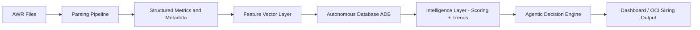

# Agentic AI AWR Advisor

  <b>From AWR → Decision → Action</b> 
  Autonomous Performance & OCI Sizing Advisor

  
  
  
  
  
  

---

## Executive Overview

The OCI AWR Agentic AI Sizing Advisor is a **deterministic + agentic AI system** that transforms Oracle AWR reports into:

- Root-cause performance diagnostics  
- Prioritized remediation actions  
- AI-guided decision support  
- OCI infrastructure sizing recommendations  

This system eliminates subjective interpretation and replaces it with:

> **Repeatable, explainable, and automation-ready intelligence**

---

## Why This System Exists

Traditional AWR analysis suffers from:

- Manual interpretation  
- Inconsistent conclusions  
- Time-intensive workflows  
- Heavy reliance on expert intuition  

This platform introduces:

- Deterministic reasoning  
- Structured data pipelines  
- Automated analysis  
- AI-assisted interpretation  
- Scalable architecture for enterprise environments  

---

## Core Design Principles

- Deterministic analysis is the source of truth  
- AI augments interpretation, not facts  
- Stateless reasoning + stateful context (ADB)  
- No fabricated data or synthetic distributions  
- Observability-first architecture  
- Full auditability of decisions  

---

## End-to-End Architecture

### Data Flow

AWR (.out files)  
→ Parsing Layer  
→ Structured Metrics  
→ Feature Vector Layer  
→ ADB (State Layer)  
→ Scoring Engine  
→ Trend & Anomaly Engine  
→ Agentic Decision Engine  
→ Dashboard + OCI Sizing  

---

## Architecture Diagram

---

## Feature Vector System

Each AWR snapshot is transformed into a **feature vector** stored in:

- AWR_FEATURE_VECTOR

### Contents

- Raw extracted metrics  
- Engineered metrics  
- Derived ratios  
- Classification signals  

### Examples

- DB_CPU_PCT_DB_TIME  
- REDO_GENERATION_PER_SEC  
- CELL_SINGLE_BLOCK_LATENCY_MS  
- NETWORK_WAIT_PCT_DB_TIME  

### Purpose

Feature vectors enable:

- Scoring  
- Trend analysis  
- ML readiness  

---

## DB-Level Trend & Anomaly Engine

### Storage

Table:
- AWR_DB_METRIC_TREND  

Granularity:
- DB_NAME  
- DBID  
- METRIC_NAME  
- SNAP_BEGIN_TIME  

---

### Trend Computation

Each metric produces:

- Rolling mean  
- Rolling standard deviation  
- Slope (trend direction)  
- Percent change  
- Baseline mean / variance  

---

### Anomaly Semantics

#### Continuous Metrics

Detects:

- SPIKE  
- DROP  
- TREND_SHIFT  
- VOLATILITY_INCREASE  
- ZERO_ANOMALY  

#### State / Flag Metrics

Detects:

- ACTIVATED  
- CLEARED  
- STATE_CHANGE  

---

### Noise Control

- Absolute threshold gating  
- Low-variance suppression  
- History-aware anomaly detection  

---

## ADB (State Layer)

### Tables

- AWR_INGEST_RUN  
- AWR_SOURCE_SYSTEM  
- AWR_REPORT  
- AWR_METRIC_FACT  
- AWR_TOP_SQL_FACT  
- AWR_WAIT_EVENT_FACT  
- AWR_FEATURE_VECTOR  
- AWR_DB_METRIC_TREND  

---

### Capabilities

- Secure wallet-based connection  
- Transaction-safe ingestion  
- Time-series persistence  
- Analytical query layer  

---

## Deterministic Analysis Engine

Detects:

- CPU pressure  
- SQL concentration  
- I/O bottlenecks  
- Commit latency  
- Concurrency contention  
- RAC interconnect stress  
- Exadata inefficiencies  
- Data Guard transport issues  

---

## Scoring Engine

- Weighted deterministic scoring  
- Risk classification  
- Confidence scoring  

Used for:

- prioritization  
- decision ranking  

---

## Recommendation Engine

- Deterministic mapping (issue → action)  
- Prioritized execution plans  
- Evidence-based recommendations  

Guiding principle:

> Fix workload before scaling infrastructure  

---

## AI Narrative Layer

Produces:

- Executive Summary  
- Root Cause Analysis  
- Action Plan  
- OCI Sizing Considerations  
- Confidence + Risk  

### Constraints

- No hallucinated metrics  
- No contradiction of facts  
- Fully grounded in deterministic outputs  

---

## Dashboard Layer

### Sections

- Executive Summary  
- Decision Layer  
- Evidence Panel  
- Trend & anomaly visualization  

### Rules

- No synthetic data  
- No interpolation  
- Only real AWR-derived signals  

---

## Multi-AWR Intelligence

Enables:

- Historical trend analysis  
- Cross-snapshot anomaly detection  
- Capacity planning  
- ML pipeline readiness  

---

## Agentic Model

This is not a chatbot.

This is:

- Deterministic reasoning engine  
- AI interpretation layer  
- Stateful decision system  

### Decision Flow

AWR → Metrics → Issues → Recommendations → AI → Decision  

---

## Roadmap

### Phase 4
- Dashboard wiring  
- Domain-based insights  

### Phase 5
- Recommendation persistence  
- Action tracking  

### Phase 6
- Outcome tracking  
- ML feedback loop  

---

## Value Proposition

From AWR → Decision → Action

This is NOT:

- A report  
- A chatbot  

This IS:

- Autonomous performance advisor  
- OCI sizing decision engine  

---

## Status

- Parsing: Complete  
- Feature Vectors: Complete  
- Scoring Engine: Complete  
- Trend Engine: Complete  
- Anomaly Detection: Refined  
- ADB Integration: Complete  

Next:

- Dashboard wiring  
- Decision layer  
- Learning system  

---

## Quick Start

pip install -r requirements.txt  
python scripts/run_analysis.py  

---

## Project Structure

src/
  parser/
  analysis/
  reporting/
scripts/
data/
dbschema/

---

## Final Statement

This project has evolved beyond reporting.

It is now:

**A deterministic intelligence platform evolving into a fully autonomous decision system.**
