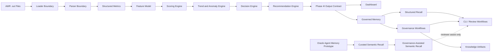
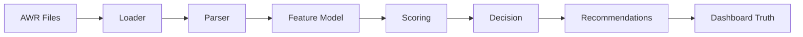
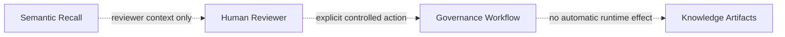
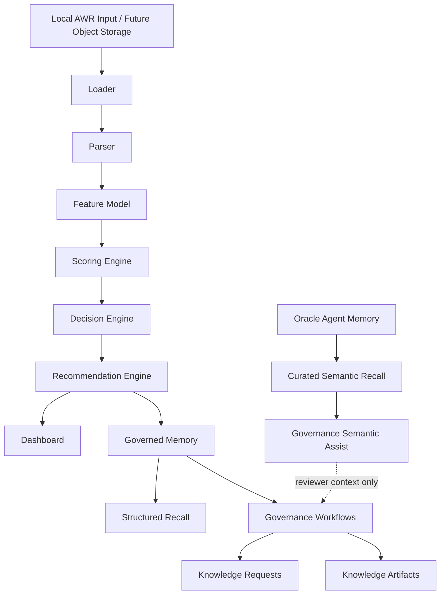

# Agentic AI AWR Advisor

<p align="center">
  <b>Deterministic Oracle AWR Intelligence with Governed Memory, Structured Recall, and Runtime-Safe Semantic Assistance</b><br/>
  Oracle Performance Intelligence Platform for Explainable Diagnosis, Governance, and OCI-Aware Advisory Workflows
</p>

<p align="center">
  
  
  
  
  
  
  
  
  
</p>

---

## Executive Summary

The **Agentic AI AWR Advisor** transforms Oracle Automatic Workload Repository (AWR) reports into deterministic, explainable performance intelligence with governed memory, structured recall, and optional semantic reviewer assistance.

The platform is designed around a strict architectural rule:

> **Deterministic runtime analysis remains the source of truth. AI and semantic memory may assist explanation and review, but they do not alter parser output, scoring, decisions, recommendations, governance approvals, or dashboard truth.**

The system currently provides:

- Resilient AWR parsing across heterogeneous report formats
- Deterministic feature extraction, scoring, trend detection, anomaly detection, and issue classification
- OCI-aware advisory narratives grounded only in deterministic evidence
- Dashboard visualization across ingestion, diagnosis, historical review, action guidance, fleet overview, governance, and semantic visibility
- Governed Phase 6 memory for runs, recommendations, actions, outcomes, feedback, unknown parser signals, knowledge requests, and knowledge artifacts
- Structured read-only recall APIs and CLI workflows
- Isolated Oracle Agent Memory prototype and curated semantic recall APIs
- Governance-assisted semantic recall for human reviewer context only
- Production-readiness validation and architecture documentation

This is not a generic chatbot and not a free-form interpretation engine. It is a governed, deterministic Oracle performance intelligence platform with AI-assisted explanation and strictly isolated semantic memory.

---

## Current Status

| Area | Status |
|---|---:|
| AWR parsing | Complete |
| Loader / parser boundary | Complete |
| Feature vector generation | Complete |
| Deterministic scoring | Complete |
| Decision engine | Complete |
| Recommendation engine | Complete |
| Trend and anomaly engine | Complete |
| ADB persistence | Complete |
| HTML dashboard | Complete |
| Phase 6 governed memory | Complete |
| Structured memory recall APIs | Complete |
| Unified Phase 6 CLI | Complete |
| Oracle Agent Memory prototype scaffold | Complete |
| Oracle Agent Memory live instrumentation | Complete, live environment validation pending |
| Curated semantic recall APIs | Complete |
| Governance-assisted semantic recall | Complete |
| Dashboard semantic visibility | Complete |
| Phase 6 validation framework | Complete |
| Phase 6 production readiness certification | Complete |
| Phase 6 documentation and release packaging | Complete |

---

## Core Architectural Principle

The platform separates runtime truth from memory and semantic context.

```text
Deterministic Runtime Truth
  Parser
  Feature Model
  Scoring Engine
  Decision Engine
  Recommendation Engine
  Dashboard Truth

Governed Memory
  Run History
  Recommendation History
  Action Tracking
  Outcome Tracking
  Feedback Capture
  Unknown Signal Review
  Knowledge Requests
  Knowledge Artifacts
  Structured Recall

Semantic Context
  Oracle Agent Memory Prototype
  Curated Semantic Recall
  Governance-Assisted Semantic Recall
  Reviewer-Assist Context
```

Semantic memory is intentionally non-authoritative in Phase 6.

It may provide context to a human reviewer, but it cannot:

- modify parser extraction
- modify feature vectors
- modify scores
- modify decision posture
- modify recommendations
- approve governance requests
- activate artifacts
- change dashboard truth
- introduce autonomous learning

---

## Why This System Exists

Traditional AWR analysis is difficult to operationalize because it often depends on:

- manual expert interpretation
- inconsistent conclusions across reviewers
- fragile report parsing
- limited repeatability
- limited explainability
- weak connection between diagnosis, actions, outcomes, and future review

This platform replaces ad hoc AWR review with a structured, auditable intelligence workflow:

```text
AWR Reports
→ Deterministic Parsing
→ Structured Metrics
→ Feature Engineering
→ Scoring
→ Trend / Anomaly Analysis
→ Decision Posture
→ Recommendations
→ Dashboard Evidence
→ Governed Memory
→ Structured Recall
→ Reviewer-Assisted Semantic Context
```

The result is a repeatable, evidence-grounded process that can support performance engineering, governance, demo workflows, and future learning systems without compromising deterministic runtime truth.

---

## Phase Model

The project follows a locked phase model.

| Phase | Name | Purpose | Status |
|---|---|---|---:|
| Phase 4 | Brain | Backend intelligence, scoring, trends, decisions, recommendations, output contract | Complete |
| Phase 5 | Face | Dashboard, visualization, presentation, user-facing evidence | Complete |
| Phase 6 | Memory | Governed persistence, recall, governance, semantic context, CLI, validation | Complete |
| Phase 7 | Learning | Outcome-aware learning and adaptive improvement, with human control | Future |

Phase 6 does **not** introduce autonomous learning. It establishes the governed memory and semantic context foundation required for future Phase 7 work.

---

## Phase 6 Completion Summary

Phase 6 is now production-ready from an architectural and operational perspective.

Completed Phase 6 capabilities include:

- Governed deterministic memory persistence
- Run history capture
- Recommendation history capture
- Action tracking
- Outcome tracking
- Feedback capture
- Parser unknown signal capture and review
- Approval workflow foundation
- Knowledge request and artifact foundation
- Read-only governance dashboard visibility
- Structured memory recall APIs
- Deterministic recall ordering and filtering
- Unified Phase 6 CLI
- Oracle Agent Memory prototype scaffold
- Live validation instrumentation for Oracle Agent Memory
- Curated semantic recall APIs
- Governance-assisted semantic recall APIs
- Dashboard semantic recall visibility
- Phase 6 validation framework
- Phase 6 production readiness certification
- Phase 6 documentation and release packaging

The most important Phase 6 guarantee is:

> **Memory and semantic recall are observable, reviewable, and useful, but they do not change deterministic runtime diagnosis or recommendations.**

---

## End-to-End Architecture



---

## Runtime Truth Boundary

The deterministic runtime path is:



Only deterministic runtime components produce diagnostic truth.

Semantic recall is outside this path.



---

## AWR Format Resilience

AWR reports vary significantly across versions, topologies, configurations, and enabled features. The parser is designed for real-world report variability rather than idealized report structure.

Observed variability includes:

- Oracle version differences such as 11g, 12c, 19c, and newer formats
- Single instance, RAC, Data Guard, Exadata, and mixed topology signals
- Optional sections that appear only when features or options are enabled
- Section ordering drift
- Patch-level formatting differences
- Missing, sparse, or truncated sections

The parser uses a section-driven, pattern-based architecture.

Key characteristics:

- Section discovery by semantic headers and section boundaries
- Loose coupling between section location and extraction logic
- Content normalization before extraction
- Graceful degradation when optional sections are missing
- Parse diagnostics for missing or unknown sections
- Deterministic extraction only; no inferred metrics
- Unknown parser signals persisted for governed review

Operationally, missing or partial sections do not fail the pipeline. They are surfaced as diagnostics, validation notes, or governance review items.

---

## Loader and Parser Boundary

The loader and parser are intentionally separate.

### Loader Boundary

The loader owns:

- input source discovery
- local file inventory
- source path metadata
- file read status
- loader notes

The loader does not inspect AWR report content and does not extract metrics.

### Parser Boundary

The parser owns:

- AWR text parsing
- section discovery
- metric extraction
- topology and platform hints
- parse diagnostics
- unknown signal detection

The parser does not discover source directories or own input inventory.

This separation is validated by boundary tests and documented in the repository naming policy.

---

## Feature Vector System

Each parsed AWR report is transformed into structured feature signals used for deterministic analysis and future similarity intelligence.

Feature vectors may include:

- raw extracted metrics
- engineered metrics
- derived ratios
- workload classification signals
- topology and platform indicators
- wait-event signals
- SQL concentration signals
- memory, I/O, commit, RAC, and Data Guard indicators

Feature vectors support:

- scoring
- decision input construction
- trend analysis
- anomaly detection
- similarity intelligence
- future ML readiness

---

## Deterministic Analysis Engine

The deterministic analysis layer evaluates Oracle-native performance domains.

Authoritative issue domains:

1. CPU
2. IO
3. MEMORY
4. COMMIT
5. RAC
6. ADG

The engine detects and classifies signals such as:

- CPU pressure
- User I/O pressure
- SQL concentration
- commit latency
- concurrency contention
- RAC interconnect stress
- Data Guard transport or role-state evidence
- memory and spill pressure where source metrics exist
- topology-specific operational signals

The system explicitly avoids converting missing metrics into evidence. If data is unavailable, the narrative and dashboard state that the metric could not be evaluated.

---

## Trend and Anomaly Engine

The trend engine supports multi-snapshot analysis across AWR windows.

It provides:

- historical metric continuity
- rolling baselines
- spike/drop detection
- trend direction
- anomaly windows
- topology event interpretation
- sparse-data handling

Trend and anomaly conclusions remain deterministic and evidence-bound.

---

## Decision Engine

The decision engine produces a stable posture and evidence package.

Typical posture examples include:

- OK
- WARNING
- CRITICAL
- TUNE FIRST
- SCALE NOW
- DEFER SCALING PENDING VALIDATION
- INSUFFICIENT DATA TO RECOMMEND SCALING

The decision object remains grounded in deterministic evidence and confidence rules.

Semantic recall cannot change the decision posture.

---

## Recommendation Engine

The recommendation engine maps deterministic issue findings to action guidance.

Principle:

> **Tune workload behavior before scaling infrastructure unless deterministic evidence supports scaling.**

Recommendations are evidence-based and do not use semantic recall as runtime input.

---

## AI Narrative Layer

The AI narrative layer provides executive and technical explanation grounded in deterministic findings.

It may produce:

- executive summary
- technical narrative
- root cause interpretation
- recommended action plan
- OCI sizing considerations
- confidence assessment
- risk of being wrong

AI narrative constraints:

- no invented metrics
- no unsupported root causes
- no contradiction of deterministic evidence
- no use of unavailable metrics as evidence
- no recommendations that contradict deterministic guidance
- no semantic memory override

The current OCI provider display is separated into:

- runtime/debug identity: raw provider and configured model
- human-facing display: friendly provider and model labels

---

## Dashboard Layer

The dashboard is the user-facing visualization layer. It renders deterministic evidence, governed memory status, governance visibility, and semantic recall visibility without changing runtime truth.

Current screens:

1. Ingestion
2. Analysis
3. Selector
4. Historical Review
5. Recommendation / Action
6. Fleet Overview

Dashboard principles:

- deterministic evidence remains authoritative
- semantic recall is never displayed as diagnostic evidence
- governance is read-only unless explicit future controls are introduced
- governed memory and semantic recall are visually distinguished
- missing metrics are handled truthfully

Top-right status now uses:

```text
Governed Memory: Active
```

This refers to deterministic Phase 6 memory persistence, not autonomous AI memory or semantic learning.

---

## Governed Memory Layer

Phase 6 governed memory captures operational and governance state.

It includes:

- run history
- recommendation history
- action history
- outcome history
- feedback history
- unknown signal history
- knowledge update requests
- knowledge artifacts

Governed memory is deterministic, structured, auditable, and reviewable.

It does not alter runtime scoring, decision posture, recommendation generation, or parser behavior.

---

## Structured Recall APIs

Structured recall provides read-only access to governed memory.

Recall APIs include:

- run history recall
- recommendation history recall
- action history recall
- outcome history recall
- feedback history recall
- unknown signal recall
- knowledge request recall
- knowledge artifact recall
- memory summary recall

Recall supports:

- filtering
- limit enforcement
- deterministic ordering
- disabled-safe behavior
- structured JSON output

Structured recall is observational and read-only.

---

## Oracle Agent Memory Prototype

Oracle Agent Memory is introduced as an isolated semantic memory prototype.

It is:

- optional
- disabled-safe
- non-authoritative
- reviewer-assist only
- isolated from runtime truth

The prototype includes:

- adapter layer
- test script
- live validation instrumentation
- curated semantic payload support
- semantic search support
- boundary documentation

Live semantic insert/search requires the appropriate Oracle Agent Memory environment configuration.

---

## Curated Semantic Recall

Curated semantic recall provides non-authoritative semantic context from Oracle Agent Memory entries.

Capabilities include:

- recall by database name
- recall by issue type
- recall by posture
- related context recall
- curated semantic summaries

Semantic recall responses explicitly include:

```json
{
  "authoritative": false,
  "runtime_influence": false,
  "semantic_only": true
}
```

Semantic summaries use wording such as:

- semantic recall suggests
- retrieved semantic context indicates
- historical semantic entries referenced

They do not make recommendations, determine root cause, assign severity, or change posture.

---

## Governance-Assisted Semantic Recall

Governance-assisted semantic recall allows human reviewers to retrieve semantic context during governance review workflows.

Supported assistance areas:

- unknown signal review
- parser governance review
- knowledge request review
- artifact review

This layer is reviewer-assist only.

It cannot:

- approve anything
- reject anything
- classify parser signals automatically
- materialize artifacts
- alter runtime truth
- introduce learning behavior

---

## Unified Phase 6 CLI

The unified CLI provides an operational control surface for Phase 6.

Entrypoint:

```bash
PYTHONPATH=. .venv/bin/python scripts/awr_memory_cli.py --help
```

Command groups:

- `status`
- `recall`
- `review`
- `governance`
- `artifact`
- `semantic`

Examples:

```bash
PYTHONPATH=. .venv/bin/python scripts/awr_memory_cli.py status
```

```bash
PYTHONPATH=. .venv/bin/python scripts/awr_memory_cli.py recall summary
```

```bash
PYTHONPATH=. .venv/bin/python scripts/awr_memory_cli.py recall unknown-signals \
  --status NEW \
  --limit 5 \
  --order newest
```

```bash
PYTHONPATH=. .venv/bin/python scripts/awr_memory_cli.py semantic recall \
  --query "SPRTRN io pressure" \
  --limit 5
```

Write commands require an explicit actor. Semantic commands are read-only and non-authoritative.

---

## Validation Framework

Phase 6 includes a validation framework that verifies the architectural safety boundaries.

Validation categories include:

- runtime isolation
- semantic isolation
- governance safety
- dashboard truth preservation
- CLI operational safety
- memory persistence integrity
- recall correctness
- semantic non-authoritativeness
- import isolation
- write discipline

Run validation:

```bash
PYTHONPATH=. .venv/bin/python scripts/run_phase6_validation.py
```

Run readiness check:

```bash
PYTHONPATH=. .venv/bin/python scripts/run_phase6_readiness_check.py
```

The readiness runner emits a production readiness JSON summary.

---

## Cloud-Native and OCI Design

The platform is designed for OCI-oriented performance intelligence.

Key OCI-oriented areas:

- Oracle Autonomous Database for state and analytics
- OCI Generative AI for grounded narrative support
- OCI Object Storage positioning for raw AWR staging
- Oracle Agent Memory prototype for semantic reviewer assistance
- Wallet-based database connectivity
- structured validation and operational readiness scripts

Object Storage ingestion is positioned as a future controlled source option. Current default runtime remains local staged AWR input unless configured otherwise.

---

## High-Level System Flow



---

## Repository Structure

Key directories:

```text
ai_providers/       Provider adapters and provider router
awr_dashboard/      Generated dashboard HTML bundle, intentionally versioned
data/               Local AWR input and validation data packs
dbschema/           Schema, migration, validation, and memory DDL
docs/architecture/  Architecture, validation, readiness, and release docs
scripts/            Runtime, validation, CLI, and operational entrypoints
src/analysis/       Scoring, decision, trends, output contract, narrative prep
src/ingest/         ADB ingestion and persistence workflow
src/loader/         Source discovery and file inventory boundary
src/memory/         Governed memory, recall, semantic, and governance services
src/models/         Dataclasses and structured contracts
src/parser/         AWR parsing and deterministic extractors
src/reporting/      Dashboard rendering and display metadata
src/validation/     Validation harnesses
tests/              Unit and architectural validation tests
```

---

## Important Entry Points

Runtime analysis:

```bash
AI_PROVIDER=oci PYTHONPATH=. .venv/bin/python scripts/run_analysis.py
```

Dashboard:

```text
awr_dashboard/index.html
```

Structured recall CLI:

```bash
PYTHONPATH=. .venv/bin/python scripts/recall_memory.py --summary
```

Unified Phase 6 CLI:

```bash
PYTHONPATH=. .venv/bin/python scripts/awr_memory_cli.py status
```

Oracle Agent Memory prototype test:

```bash
PYTHONPATH=. .venv/bin/python scripts/test_oracle_agent_memory.py
```

Phase 6 validation:

```bash
PYTHONPATH=. .venv/bin/python scripts/run_phase6_validation.py
```

Phase 6 readiness:

```bash
PYTHONPATH=. .venv/bin/python scripts/run_phase6_readiness_check.py
```

---

## Quick Start

Install dependencies:

```bash
pip install -r requirements.txt
```

Run analysis:

```bash
AI_PROVIDER=oci PYTHONPATH=. .venv/bin/python scripts/run_analysis.py
```

Open dashboard:

```text
awr_dashboard/index.html
```

Run Phase 6 validation:

```bash
PYTHONPATH=. .venv/bin/python scripts/run_phase6_validation.py
```

Run readiness check:

```bash
PYTHONPATH=. .venv/bin/python scripts/run_phase6_readiness_check.py
```

---

## Environment Configuration

The project uses `.env` and environment variables for provider and OCI configuration.

Representative variables:

```bash
AI_PROVIDER=oci
OCI_MODEL=xai.grok-4-1-fast-reasoning
OCI_MODEL_ID=<model_ocid>
OCI_COMPARTMENT_ID=<compartment_ocid>
OCI_CONFIG_PROFILE=DEFAULT
OCI_REGION=us-phoenix-1

ADB_USER=<user>
ADB_PASSWORD=<password>
ADB_DSN=<dsn>
TNS_ADMIN=<wallet_path>
ADB_WALLET_PASSWORD=<wallet_password>

ORACLE_AGENT_MEMORY_ENABLED=false
```

Do not hardcode credentials.

`AI_PROVIDER=oci` is the intended OCI-native path. OpenAI support exists through provider adapters but should not silently override OCI when OCI is configured.

---

## Documentation Index

Important architecture docs:

- `docs/architecture/README.md`
- `docs/architecture/repository_structure_and_naming.md`
- `docs/architecture/phase6_memory_architecture.md`
- `docs/architecture/phase6_operational_model.md`
- `docs/architecture/phase6_acceptance_criteria.md`
- `docs/architecture/phase6_validation_matrix.md`
- `docs/architecture/phase6_production_readiness.md`
- `docs/architecture/phase6_release_certification.md`
- `docs/architecture/phase6_operational_checklist.md`
- `docs/architecture/phase6_component_inventory.md`
- `docs/architecture/phase6_repository_map.md`
- `docs/architecture/phase6_release_notes.md`
- `docs/architecture/phase6_demo_walkthrough.md`
- `docs/architecture/oracle_agent_memory_boundary.md`
- `docs/architecture/phase6_cli_operations.md`

---

## What Phase 6 Does Not Do

Phase 6 does not include:

- autonomous learning
- semantic runtime influence
- automatic parser evolution
- automatic recommendation changes from semantic memory
- automatic approval of governance requests
- automatic artifact activation
- self-modifying runtime behavior
- hidden AI-driven scoring

Those capabilities, if ever introduced, belong to future Phase 7 work and must remain human-governed and validation-backed.

---

## Phase 7 Direction

Phase 7 is the future learning and adaptation phase.

Potential Phase 7 capabilities may include:

- outcome-aware semantic correlation
- cross-run learning candidate generation
- human-approved parser improvement candidates
- human-approved recommendation refinement candidates
- semantic clustering for fleet intelligence
- controlled feedback loops

Phase 7 must preserve the architecture established in Phase 6:

> semantic memory may support learning candidates, but human governance and deterministic validation remain mandatory before runtime behavior changes.

---

## Final Statement

The Agentic AI AWR Advisor has evolved from AWR parsing and reporting into a governed Oracle performance intelligence platform.

Its central strength is not merely AI assistance. Its central strength is architectural discipline:

- deterministic runtime truth
- governed memory
- structured recall
- semantic context without runtime contamination
- human-controlled governance
- validated operational boundaries

This makes the platform suitable for explainable Oracle performance review, OCI advisory demonstrations, governed memory workflows, and future outcome-aware learning without sacrificing deterministic trust.
